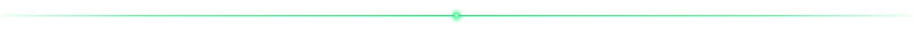

  

  

  
  
  
  
  
  
  
  
  
  

  
  
  
  
  
  
  

  

  

<strong>Classeviva Api Research</strong>

  
  
  

<strong>Hardware and Home Lab</strong>

  
  
  

<strong>Web</strong>

  

<strong>Tools and Helpers</strong>

  
  
  
  

  

