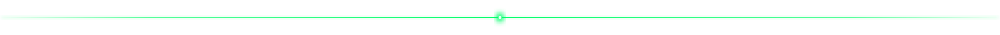

  

  

  
  
  
  
  
  
  
  
  
  

  
  
  
  
  
  
  

  

  

<strong>Mobile</strong> Flutter apps, fully on-device

  

<strong>Hardware and Home Lab</strong> Cameras, Home Assistant, ESP32, macropads

  
  
  
  
  

<strong>Web</strong> Self-hosted and CMS plugins

  
  

<strong>Tools and Helpers</strong> Small Python and shell utilities

  
  
  
  

<strong>PNLUG</strong> Linux user group tooling

  

<strong>Classeviva</strong> School register API research

  
  
  

  

